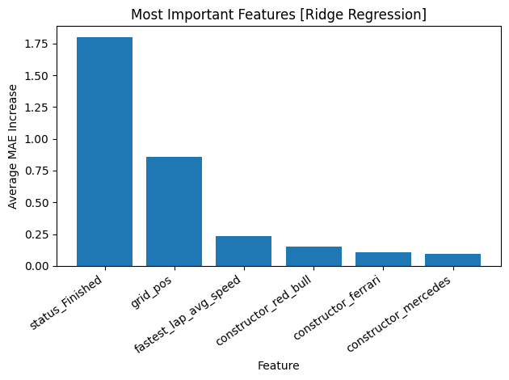
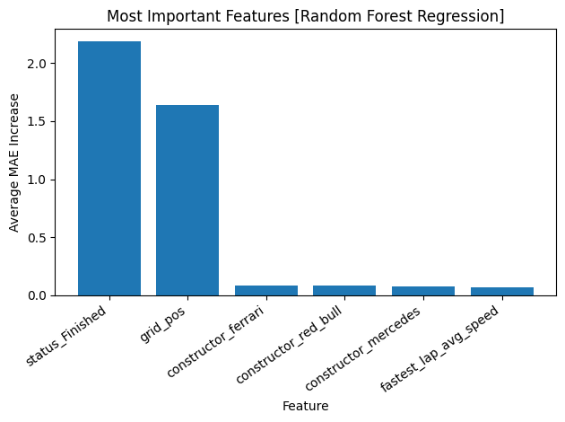

# F1 Regressor

An exploratory machine learning project aimed towards gaining more experience with ML tooling through finding the best predictors for the finishing position of Formula 1 drivers. Manually sourcing the data from the now deprecated [Ergast API](https://ergast.com/mrd/), I explored driver specific features like starting grid position, fastest lap times, and average speed during the fastest lap as well as non-driver specific ones like track and constructor. I explored a random forest regressor, a ridge regressor, and a support vector regressor. The SVR was able to predict finishing positions within about **2 positions** with the most important features being an indicator variable showing whether the driver finished the race and starting grid position (by permutation feature importance).

## Methodology

**1. Data Collection**

Formula 1 changes drivers and teams freqently and I wanted to avoid, as much as possible, introducing a bias towards drivers and teams that appear in more frequently in races (or one against those that don't). This led to the decision of only considering the last 20 seasons (from 2025). I retrieved JSONs from the [Ergast API](https://ergast.com/mrd/) containing the details and results of every race (each JSON representing one race) for each season, stripping away extraneous information and organizing them into a dataframe where every instance holds information about a driver and their results at a specified race. Alongside the target variable (integer finsishing position), each instance in the raw dataframe had the following features:

 * Circuit name (String)
 * Driver name (String)
 * Constructor name (String)
 * Starting grid position (Integer)
 * Status - whether or not the driver finished the race, and if not, why (String)
 * Missing lap flag - whether or not there was a fastest lap recorded for the driver (0 or 1)
 * Driver's fastest lap time if there was a fastest lap recorded for them. Otherwise, the integer 300 representing 300 seconds (String | 300)
 * Average speed during the driver's fastest lap, if it was recorded. Otherwise, the integer 0 representing 0 kph (NumPy float | 0)

I chose deal with missing fastest lap times like this becuase I felt it was better than not considering lap times at all. The desicion to impute the missing values with 300s and 0kph was somewhat arbitrary, but my goal was to "punish" these instances as a missing fastest lap time means that the driver didn't even start the race. On top of this, I thought it could be fruitful to build a correlation between the missing lap flag feature and the status feature (every time the missing lap flag has a value of 1, the status feature will have a value of something other than "Finished" and vice versa). The resulting table is in `data/dataframes/raw.csv`.

**2. Data preprocessing**

The first preprocessing step I took was translating the strings in the data into machine readable values. I converted the average speeds of the fastest laps from a string in "mm:ss.ss" format to a number representing how may seconds that is. It's worth noting that none of these converted values get very close to the 300s imputation for missing lap times. After that I one hot encoded the circuit names, driver names, constructors, and statuses, greatly expanding the number of features in the data.

Next, I created the first part of my pipeline. As a ColumnTransformer from ScikitLearn, I applied the ScikitLearn standard scaler to all the features that were originally numerical. The other half of the pipeline will be the model we specify. The resulting table, before applying standard scaling since it's applied at training time, is in `data/dataframes/raw_numerical.csv`.

**3. Cross validation, training, and testing**

Splitting the data in to 80% for training and 20% for testing, I ran a 10-fold grid search cross validation for each model. As for the parameter grids for each model, I chose to keep it simple and not explore very many parameters; I began with broad grids and iteratively updated them in the direction that scored best until the values the search converged to were not at the edges of the their grids. I used negative mean absolute error for the cross validation scoring.

After each cross validation is done, the model with the best score is serialized and saved using joblib and used on the testing set, saving their predictions in `data/results`. (The serialized models are too large to push to GitHub, so they are not included in this repo).

**4. Feautre importance**

Finally, I thought it would be interesting to see which features ended up being the best predictors for finishing position. For simplicity, I took a model agnostic approach and used ScikitLearn's permuation feature importance algorithm. Using joblib to recontruct my best models, I ran the algorithm on them using negative mean absolute error as the scoring metric. I organized the results into a two column tables (feature name and score) sorted in descending order by score (most important features towards the top). These tables are saved in `data/importances`.

## Results

For each model, I showed their performance on the testing set via two "Actual vs. Predicted" plots. The first is a regular scatter plot with the actual finishing positon on the x-axis and the model predicted finsihing position on the y-axis; Each blue dot is a prediction and the red line shows the path of perfect prediction.

This plot is a bit hard to interpret since there are so many predictions and so many of them overlap. The second "Actual vs. Predicted" plot shows the density of prediction at a certain area. The more predictions there are wihtin a certain hexagon, the more the hexagons color will change according the bar on the right. This way we can more easily see how close the model's predictions were to the perfect predictions shown by the red line.

Additionally, I made a bar chart showing the most important featues for the model. With the permutation feature importance algorithm using negative mean absolute error as the scoring metric, I was able to find the features that most negatively affected performance when their values were shuffled (and effectively, when any learned relationship between that feature and the target variable were destroyed).

* **Ridge Regression [MAE: 2.556]**
 
The ridge regressor performed the worst with a mean absolute error above 2.5. 

    
    

    

* **Random Forest Regression [MAE: 2.164]**

The random forest regressor outperformed the the ridge regressor 15.3%.

    
    

    

* **Support Vector Regression [MAE: 2.130]**

The supprt vector regressor performed the best out of all models, just beating the random forest regressor by 1.57% and shadowing the ridge regressor by 16.6%.

    
    

    

Thoguh I was able to deduce a winning model by MAE, it's clear that each performed relatively similarly; Each of them can predict a driver's finishing position within 2 to 2.5 places of the actual position. I expected the most important feauture to be the drivers' starting grid position but it was consistently number two behind the finsihing status indicator variable.